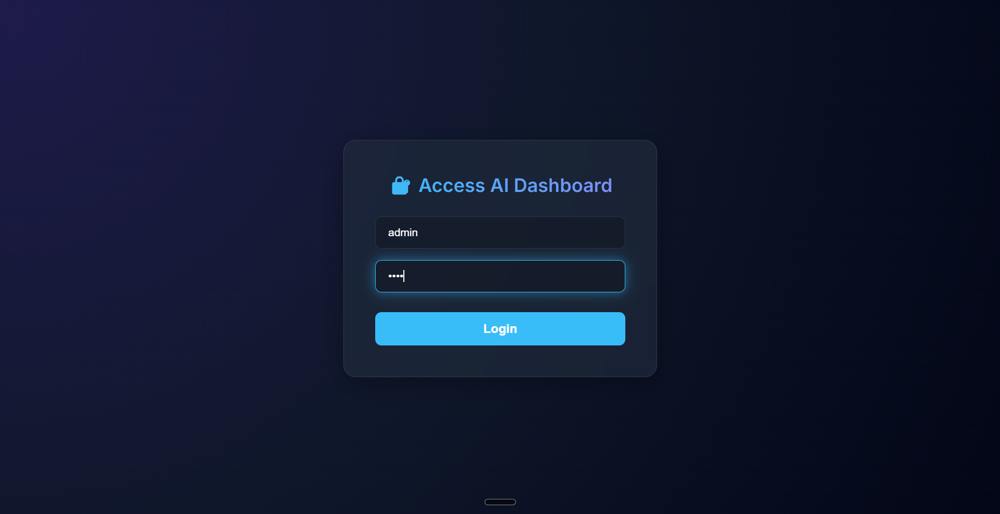
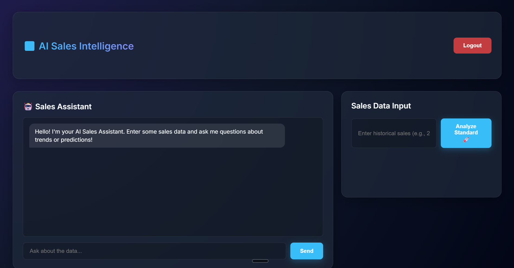
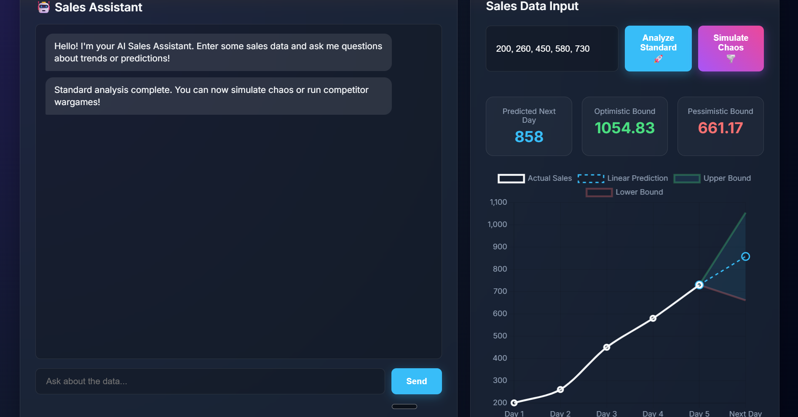
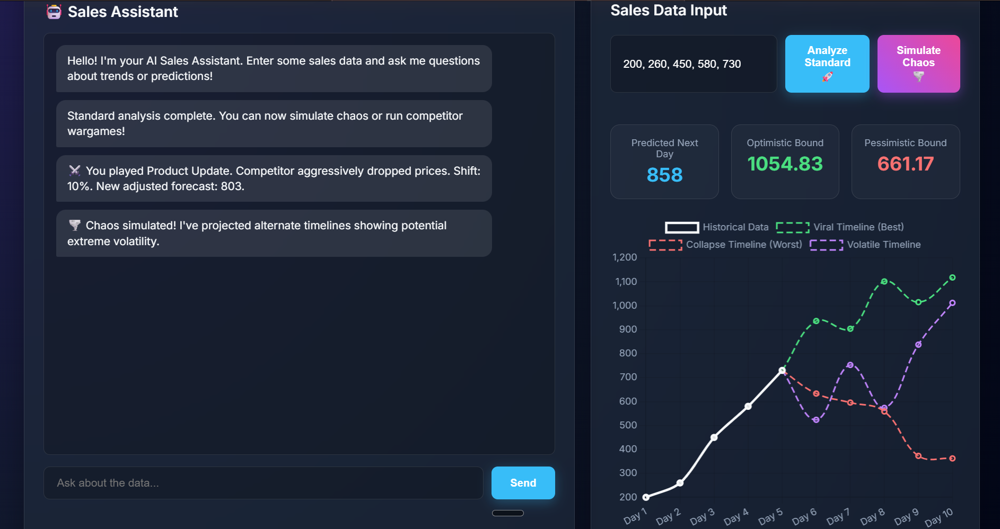

# AI Sales Forecasting Dashboard

## 📊 Features
- AI-based sales prediction
- Interactive charts using Chart.js
- User input system
- Login authentication
- Optimization using Dijkstra algorithm

## 🧠 Algorithms Used
- Linear Regression → Sales prediction
- BFS / DFS → Search exploration
- Dijkstra → Shortest path optimization
- A* → Heuristic-based prediction
- Alpha-Beta Pruning → Decision making

## 💻 Tech Stack
- Python (Flask)
- Machine Learning (Scikit-learn)
- HTML, CSS, JavaScript
- Chart.js

## 🌐 Live Demo
(http://localhost:10000/)

## 📸 Screenshots

### 🔐 Login Page


### ✍️ Data Input


### 📊 Analyzed Sales Graph


### 📈 Competitor Strategy


### 📈 Chaos Simulation Graph


## 🚀 How to Run Locally
```bash
pip install -r requirements.txt
python app.py
